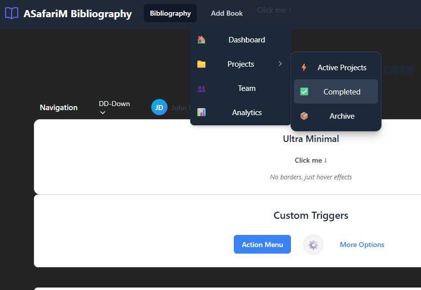
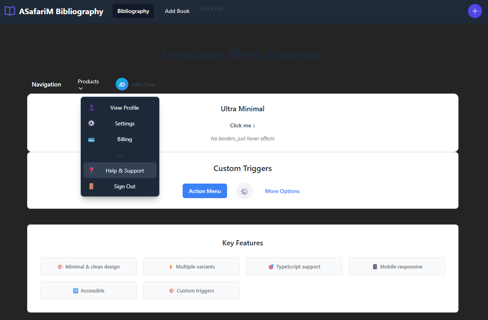
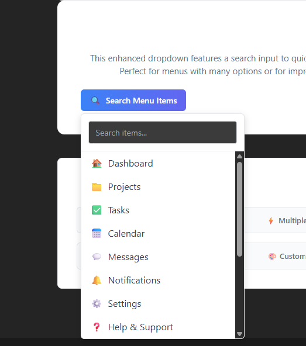

# @asafarim/dd-menu

[](https://www.npmjs.com/package/@asafarim/dd-menu)
[](https://www.typescriptlang.org/)
[](https://opensource.org/licenses/MIT)

A powerful, customizable dropdown menu component for React with TypeScript. Features recursive nesting, multiple themes, custom triggers, and accessibility support. See a live demo at [asafarim.com](https://bibliography.asafarim.com/dd) for different use cases.


## Features

- 🔄 **Recursive Nesting**: Create unlimited nested dropdown menus
- 🎨 **Multiple Variants**: Choose from navbar, minimal, and default styles
- 🌓 **Theme Support**: Built-in light, dark, and auto themes
- 📱 **Responsive**: Works perfectly on all device sizes
- ♿ **Accessible**: Keyboard navigation and ARIA support
- 🔧 **Highly Customizable**: Custom triggers, icons, and styling options
- 🔍 **Searchable Option**: Case-insensitive search to filter dropdown items
- 🧩 **Zero Dependencies**: Pure React and CSS implementation

## Installation

```bash
# Using npm
npm install @asafarim/dd-menu

# Using yarn
yarn add @asafarim/dd-menu

# Using pnpm
pnpm add @asafarim/dd-menu
```

## Basic Usage

```tsx
import DDMenu, { MenuItem } from "@asafarim/dd-menu";
import "@asafarim/dd-menu/dist/index.css";

const App = () => {
  const menuItems: MenuItem[] = [
    { id: "home", label: "Home", link: "/", icon: "🏠" },
    {
      id: "products",
      label: "Products",
      icon: "📦",
      children: [
        { id: "electronics", label: "Electronics", link: "/products/electronics" },
        { id: "clothing", label: "Clothing", link: "/products/clothing" },
      ],
    },
    { id: "about", label: "About Us", link: "/about", icon: "ℹ️" },
  ];

  return (
    <DDMenu 
      items={menuItems} 
      theme="auto" 
      variant="default" 
      size="md" 
      placement="bottom-start"
      closeOnClick={true}
    />
  );
};
```

## Showcase Examples

### Navigation Menu



```tsx
<DDMenu
  items={navMenuItems}
  className="dd-menu--navbar"
  placement="bottom"
  closeOnClick={true}
  size="lg"
  theme="auto"
  trigger={
    <div className="dd-menu__trigger dd-menu__trigger--text">
      Navigation
    </div>
  }
/>
```

### User Profile Menu



```tsx
<DDMenu
  items={profileMenuItems}
  className="dd-menu--navbar"
  trigger={
    <div className="user-profile-trigger">
      <div className="avatar">JD</div>
      <span>John Doe</span>
    </div>
  }
  placement="bottom-end"
/>
```

### Custom Button Trigger

```tsx
<DDMenu 
  items={navMenuItems} 
  className="dd-menu--minimal"
  trigger={
    <button className="action-button">
      Action Menu
    </button>
  }
/>
```

### Searchable Dropdown



```tsx
<div className="searchable-dropdown">
  <div className="searchable-dropdown__trigger">
    <span>🔍</span> Search Menu Items
  </div>
  
  {isOpen && (
    <div className="searchable-dropdown__menu">
      <div className="searchable-dropdown__search">
        <input
          type="text"
          placeholder="Search items..."
          value={searchTerm}
          onChange={handleSearchChange}
          autoFocus
        />
      </div>
      
      <div className="searchable-dropdown__items">
        {filteredItems.map((item, index) => (
          <div
            key={item.id}
            className={`searchable-dropdown__item ${focusedIndex === index ? 'focused' : ''}`}
            onClick={() => handleItemClick(item)}
            onMouseEnter={() => setFocusedIndex(index)}
          >
            {item.icon && <span>{item.icon}</span>}
            <span>{item.label}</span>
          </div>
        ))}
      </div>
    </div>
  )}
</div>
```

## API Reference

### DDMenu Props

| Prop | Type | Default | Description |
|------|------|---------|-------------|
| `items` | `MenuItem[]` | Required | Array of menu items |
| `theme` | `'light' \| 'dark' \| 'auto'` | `'auto'` | Menu theme |
| `variant` | `'default' \| 'navbar' \| 'minimal'` | `'default'` | Menu variant style |
| `size` | `'sm' \| 'md' \| 'lg'` | `'md'` | Menu size |
| `placement` | `'bottom' \| 'bottom-start' \| 'bottom-end' \| 'top' \| 'top-start' \| 'top-end' \| 'right' \| 'right-start' \| 'right-end' \| 'left' \| 'left-start' \| 'left-end'` | `'bottom'` | Menu placement |
| `closeOnClick` | `boolean` | `true` | Close menu when item is clicked |
| `trigger` | `ReactNode` | Default button | Custom trigger element |
| `className` | `string` | `''` | Additional CSS class names |
| `style` | `CSSProperties` | `{}` | Inline styles for the menu |

### MenuItem Type

```ts
type MenuItem = {
  id: string;
  label: string;
  link?: string;
  icon?: string | ReactNode;
  onClick?: () => void;
  disabled?: boolean;
  children?: MenuItem[];
};
```

## Styling

The component includes default styling, but you can customize it by overriding CSS variables or using the provided class names:

```css
:root {
  --dd-menu-bg: #ffffff;
  --dd-menu-text: #333333;
  --dd-menu-hover-bg: #f5f5f5;
  --dd-menu-hover-text: #000000;
  --dd-menu-disabled-text: #999999;
  --dd-menu-border: #e0e0e0;
  --dd-menu-shadow: 0 2px 10px rgba(0, 0, 0, 0.1);
}

[data-theme="dark"] {
  --dd-menu-bg: #333333;
  --dd-menu-text: #f5f5f5;
  --dd-menu-hover-bg: #444444;
  --dd-menu-hover-text: #ffffff;
  --dd-menu-disabled-text: #777777;
  --dd-menu-border: #444444;
  --dd-menu-shadow: 0 2px 10px rgba(0, 0, 0, 0.3);
}
```

## Accessibility

The dropdown menu is built with accessibility in mind:

- Keyboard navigation (Tab, Enter, Escape, Arrow keys)
- ARIA attributes for screen readers
- Focus management for keyboard users
- Proper contrast ratios for text

## License

MIT © [Ali Safari](https://github.com/AliSafari-IT)
